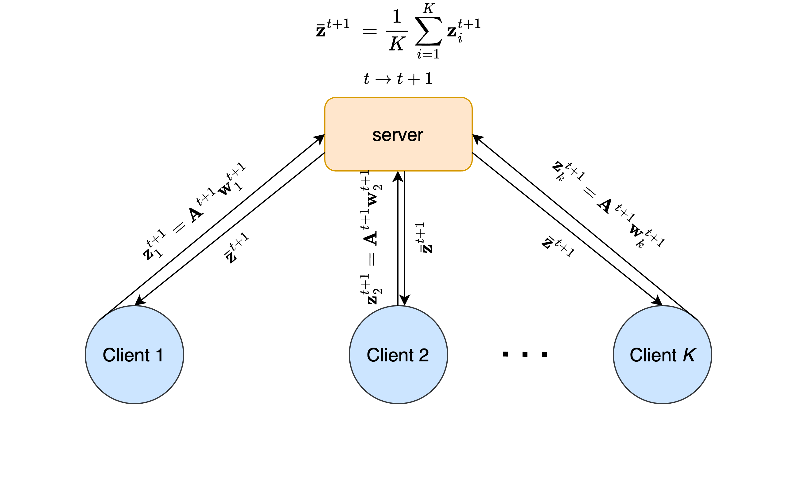

# FedRP: A Communication-Efficient Approach for Differentially Private Federated Learning Using Random Projection

This repository contains the implementation of **FedRP**, a novel federated learning algorithm that enhances communication efficiency and privacy by combining **Random Projection** with the **ADMM optimization framework**. FedRP is designed for federated learning settings and provides a strong (ϵ, δ)-Differential Privacy guarantee without sacrificing model accuracy.

-----

## 📌 Paper

> **FedRP: A Communication-Efficient Approach for Differentially Private Federated Learning Using Random Projection**
-----

## 🧠 Method Overview

FedRP introduces a secure dimension-reduction step (via random projection) on the client side before model updates are sent to the server. This significantly reduces communication costs and enhances privacy by preventing reconstruction attacks.

  * Clients use a **shared random projection matrix** to project model parameters.
  * Optimization is performed using **Consensus ADMM** in the projected space.
  * FedRP avoids the need to reverse the projections, unlike FedSketch and similar methods.
 
-----

## ✨ Key Features

  * **Communication Efficiency**: Reduces the amount of data transmitted between clients and the server by using random projections.
  * **Differential Privacy**: Provides formal privacy guarantees through the combination of random projections and ADMM.
  * **Implemented Algorithms**: Includes implementations of FedAvg, FedAvgDP, FedADMM, and FedRP for comparison.
  * **Model and Dataset**: Uses a ResNet-18 model on the CIFAR-100 dataset.

## 🆕 NEW: Dynamic Random Projection (2025)

We have extended FedRP with **dynamic projection dimension adjustment** mechanisms:

  * **FedRP_Linear**: Linearly increases projection dimension over training rounds
    - 📉 Reduces communication cost by ~72% compared to FedAvg
    - 🎯 Maintains accuracy within 3% of baseline
  
  * **FedRP_Adaptive**: Intelligently adjusts dimension based on model convergence
    - 🧠 Adapts to training dynamics automatically
    - ⚖️ Achieves optimal balance between communication and accuracy
  
  * **Non-IID Support**: Validated on heterogeneous data distributions
    - 📊 Dirichlet-based data partitioning
    - 💪 Robust performance across IID and Non-IID scenarios

**Quick Start with Dynamic FedRP**:
```bash
# Quick test (5 minutes)
python quick_test.py

# Full experiments (2-4 hours)
python resnet18_dynamic.py

# Visualize results
python visualize_results.py
```

**📚 Documentation**:
- [Dynamic FedRP README](README_DYNAMIC.md) - Detailed methodology
- [Theory Analysis](THEORY.md) - Convergence and privacy proofs
- [Experiment Guide](EXPERIMENT_GUIDE.md) - How to run experiments
- [Project Summary](PROJECT_SUMMARY.md) - Research overview

-----

## 🔧 Requirements

The code is written in Python 3 and requires the following libraries:

  * `torch`
  * `torchvision`
  * `numpy`
  * `tqdm` (for progress bars)

You can install them using pip:

```bash
pip install torch torchvision numpy tqdm
```

-----

## 🚀 How to Run

To run the experiments, simply execute the `resnet18.py` script:

```bash
python resnet18.py
```

The script will run the experiments for FedAvg, FedAvgDP, FedADMM, and FedRP sequentially. The results will be printed to the console and saved in `resnet18_cifar100_main.log`.

-----

## ⚙️ Configuration

You can modify the hyperparameters in the `Arguments` class in `resnet18.py`:

  * `batch_size`: Batch size for training (default: 64)
  * `test_batch_size`: Batch size for testing (default: 16)
  * `epochs`: Number of communication rounds (default: 30)
  * `lr`: Learning rate (default: 0.1)
  * `client_count`: Number of clients (default: 10)
  * `E`: Number of local epochs (default: 1)
  * `alpha`: Penalty parameter for the ADMM algorithm (default: 1.0)
  * `rp_dim`: Dimension of the random projection space (for FedRP) (default: 10)

-----

## 📜 License

This project is licensed under the MIT License. See the [LICENSE](https://www.google.com/search?q=LICENSE) file for details.

-----

## cite

If you use this code in your research, please cite our paper:

```bibtex
@article{fedrp2025,
  title={FedRP: A Communication-Efficient Approach for Differentially Private Federated Learning Using Random Projection},
  author={Author(s): YOUR NAME(S)},
  journal={Expert Systems With Applications},
  year={2025}
}
```
